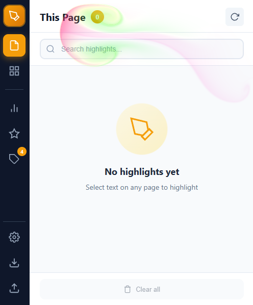
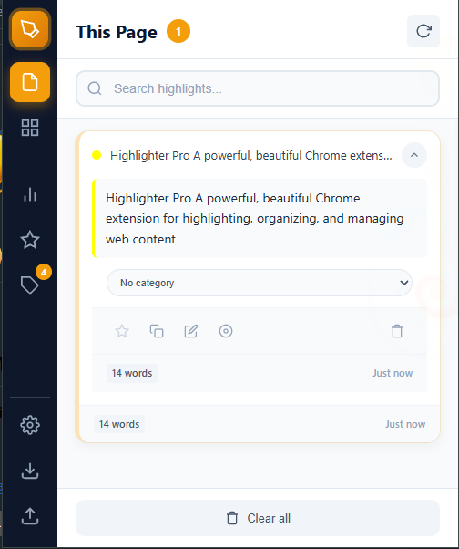
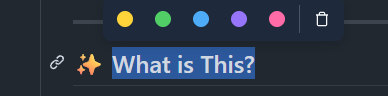
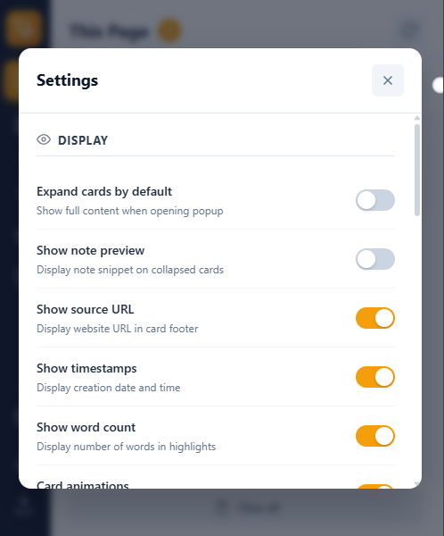
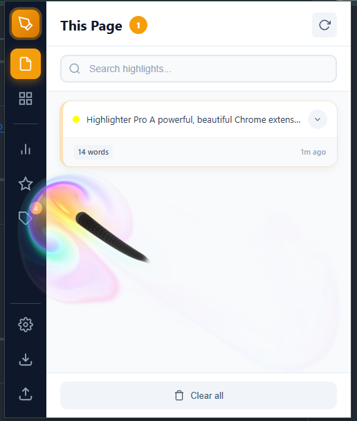

<p align="center">
  
</p>

<h1 align="center">✨ Highlighter Pro</h1>

<p align="center">
  <strong>A powerful, beautiful Chrome extension for highlighting, organizing, and managing web content</strong>
</p>

<p align="center">
  <a href="#-screenshots">Screenshots</a> •
  <a href="#-features">Features</a> •
  <a href="#-installation">Installation</a> •
  <a href="#-usage">Usage</a> •
  <a href="#%EF%B8%8F-settings">Settings</a>
</p>

<p align="center">
  
  
  
</p>

---

## 📸 Screenshots

<table>
<tr>
<td width="50%">

### 🏠 Main Interface


**Clean, modern popup** with sidebar navigation, search bar, and beautiful gradient backgrounds. Quick access to all your highlights organized by page.

</td>
<td width="50%">

### 🃏 Highlight Cards


**Premium card design** with expandable content, category dropdown, word count, timestamps, and quick action buttons (favorite, copy, edit, locate, delete).

</td>
</tr>
<tr>
<td width="50%">

### 🎨 Color Selection


**Instant color picker** appears when you select text. Choose from 5 vibrant colors with one click. Includes quick link and AI features.

</td>
<td width="50%">

### ⚙️ Settings Panel


**20+ customizable options** for display, behavior, and filters. Toggle switches for everything from card animations to word counts.

</td>
</tr>
</table>

### ⚡ Quick Mode Effects

<table>
<tr>
<td width="50%" align="center">


**Splash Cursor** — WebGL fluid simulation creates stunning visual feedback as you move your cursor

</td>
<td width="50%" align="center">



**Ribbon Trail** — Rainbow cursor trail follows your movements for a delightful highlighting experience

</td>
</tr>
</table>

---

## ✨ Features

### 🎨 Core Highlighting
| Feature | Description |
|---------|-------------|
| **Multi-Color Palette** | 5 beautiful colors + custom picker |
| **Smart Selection** | Color tooltip appears on text selection |
| **Continuous Highlights** | Clean, unbroken highlight marks |
| **Note Attachments** | Add context with personal notes |
| **Category Organization** | Organize highlights into categories |

### 🖥️ Modern Interface
| Feature | Description |
|---------|-------------|
| **Glassmorphic Design** | Stunning frosted glass UI with depth |
| **Premium Cards** | Expandable cards with full details |
| **Sidebar Navigation** | Quick access to all views |
| **Search & Filter** | Find highlights instantly |
| **Word Count & Timestamps** | Track your highlights |

### ⚡ Quick Mode
| Feature | Description |
|---------|-------------|
| **One-Click Activation** | Toggle via brand icon |
| **Splash Cursor** | WebGL fluid simulation effect |
| **Ribbon Trail** | Colorful cursor trail animation |
| **Individual Controls** | Enable/disable each effect |

### 🔧 Advanced Features
| Feature | Description |
|---------|-------------|
| **20+ Settings** | Full customization |
| **Import/Export** | JSON backup and sharing |
| **PDF Support** | Highlight PDF documents |
| **Favorites** | Star important highlights |

---

## 📥 Installation

### From Source

```bash
# 1. Clone the repository
git clone https://github.com/K11E3R/highlight_web_extension.git
cd highlight_web_extension

# 2. Load in Chrome
#    - Open chrome://extensions
#    - Enable "Developer mode" (top right)
#    - Click "Load unpacked"
#    - Select the repository folder
```

### Quick Start

1. **Pin the extension** to your toolbar
2. **Visit any webpage** and select text
3. **Choose a color** from the floating tooltip
4. **Open the popup** to manage highlights

---

## 🎯 Usage

### Basic Highlighting

1. **Select text** on any webpage
2. **Color tooltip appears** automatically
3. **Click a color** to highlight
4. **Add notes** via the popup

### Quick Mode

1. **Click the brand icon** in the popup header
2. **Visual effects activate** (splash + ribbon)
3. **Highlight with style** — enhanced visual feedback
4. **Toggle effects** individually in Settings

### Managing Highlights

| Action | How To |
|--------|--------|
| **View All** | Click extension icon |
| **Expand Card** | Click the chevron (▼) |
| **Edit Note** | Click pencil icon |
| **Change Category** | Use dropdown on card |
| **Delete** | Click trash icon |
| **Locate** | Click card to scroll |
| **Copy Text** | Click copy icon |
| **Favorite** | Click star icon |

### Categories

```
📁 Default Categories:
├── 📚 Uncategorized (default)
├── 💼 Work
├── 🔬 Research
├── 📖 Personal
└── ➕ Create Custom...
```

---

## ⚙️ Settings

### Display
| Setting | Description |
|---------|-------------|
| Expand cards by default | Show full content |
| Show note preview | Display notes on cards |
| Show source URL | Display page URL |
| Show timestamps | Display creation date |
| Show word count | Display text length |
| Card animations | Enable hover effects |

### Behavior
| Setting | Description |
|---------|-------------|
| Quick mode effects | Master toggle |
| ├─ Splash cursor | WebGL fluid effect |
| └─ Ribbon trail | Colorful cursor trail |
| Confirm before delete | Ask before removing |
| Auto-save | Save changes instantly |
| Selection tooltip | Show color picker |

### Filters
| Setting | Description |
|---------|-------------|
| Color filter | Filter by color |
| Category filter | Filter by category |
| Date filter | Filter by time |
| Search | Enable search bar |
| Sort options | Enable sorting |

---

## 🏗️ Architecture

```
highlight_web_extension/
├── manifest.json          # Extension config
├── background.js          # Service worker
├── contentScript.js       # Page injection
├── popup/
│   ├── popup.html         # UI structure
│   ├── popup.js           # Logic & state
│   ├── popup.css          # Styles
│   ├── ribbons.js         # Ribbon trail
│   └── splashCursor.js    # WebGL fluid
├── pdfViewer/             # PDF support
└── icons/                 # Extension icons
```

---

## 🎨 Color Palette

| Color | Hex | Usage |
|-------|-----|-------|
| 🟡 Yellow | `#ffd43b` | Default |
| 🟠 Orange | `#ff922b` | Warm |
| 🔴 Red | `#ff6b6b` | Important |
| 🟣 Purple | `#cc5de8` | Ideas |
| 🔵 Blue | `#4dabf7` | Reference |

---

## 🤝 Contributing

1. Fork the repository
2. Create feature branch (`git checkout -b feature/amazing`)
3. Commit changes (`git commit -m 'Add feature'`)
4. Push to branch (`git push origin feature/amazing`)
5. Open Pull Request

---

## 📄 License

MIT License - see [LICENSE](LICENSE) for details.

---

<p align="center">
  Made with ❤️ by <a href="https://github.com/K11E3R">K11E3R</a>
</p>

<p align="center">
  <a href="https://github.com/K11E3R/highlight_web_extension/issues">Report Bug</a> •
  <a href="https://github.com/K11E3R/highlight_web_extension/issues">Request Feature</a>
</p>
