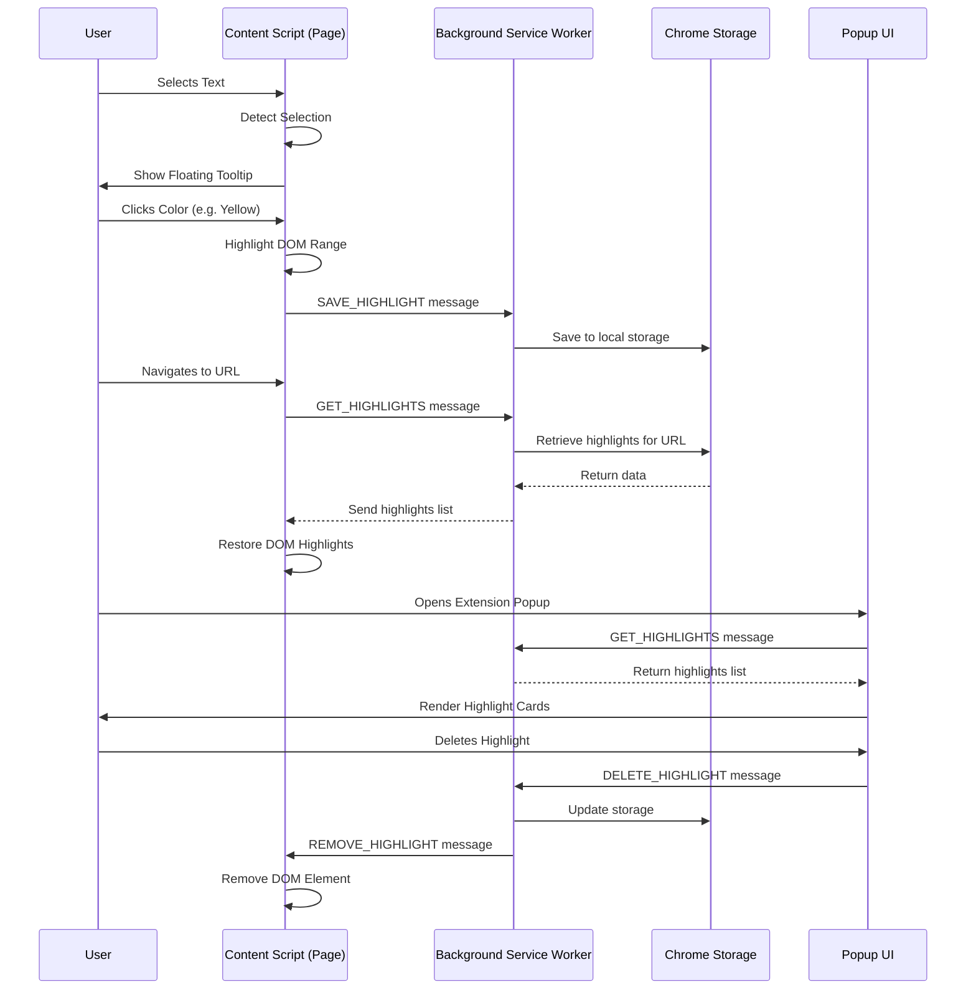
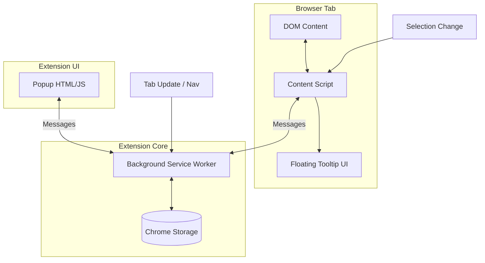

# Extension Architecture

## Core Logic Flow

```mermaid
sequenceDiagram
    participant User
    participant ContentScript as Content Script (Page)
    participant Background as Background Service Worker
    participant Storage as Chrome Storage
    participant Popup as Popup UI

    %% Highlighting Flow
    User->>ContentScript: Selects Text
    ContentScript->>ContentScript: Detect Selection
    ContentScript->>User: Show Floating Tooltip
    User->>ContentScript: Clicks Color (e.g. Yellow)
    ContentScript->>ContentScript: Highlight DOM Range
    ContentScript->>Background: SAVE_HIGHLIGHT message
    Background->>Storage: Save to local storage
    
    %% Loading Flow
    User->>ContentScript: Navigates to URL
    ContentScript->>Background: GET_HIGHLIGHTS message
    Background->>Storage: Retrieve highlights for URL
    Storage-->>Background: Return data
    Background-->>ContentScript: Send highlights list
    ContentScript->>ContentScript: Restore DOM Highlights

    %% Popup Flow
    User->>Popup: Opens Extension Popup
    Popup->>Background: GET_HIGHLIGHTS message
    Background-->>Popup: Return highlights list
    Popup->>User: Render Highlight Cards
    User->>Popup: Deletes Highlight
    Popup->>Background: DELETE_HIGHLIGHT message
    Background->>Storage: Update storage
    Background->>ContentScript: REMOVE_HIGHLIGHT message
    ContentScript->>ContentScript: Remove DOM Element
```

## Component Interaction

```mermaid
graph TD
    subgraph "Browser Tab"
        DOM[DOM Content]
        CS[Content Script]
        Tooltip[Floating Tooltip UI]
        
        DOM <--> CS
        CS --> Tooltip
    end

    subgraph "Extension Core"
        BG[Background Service Worker]
        Store[(Chrome Storage)]
        
        BG <--> Store
    end

    subgraph "Extension UI"
        Popup[Popup HTML/JS]
    end

    CS <-->|Messages| BG
    Popup <-->|Messages| BG
    
    %% Events
    Event1[Selection Change] --> CS
    Event2[Tab Update / Nav] --> BG
```
